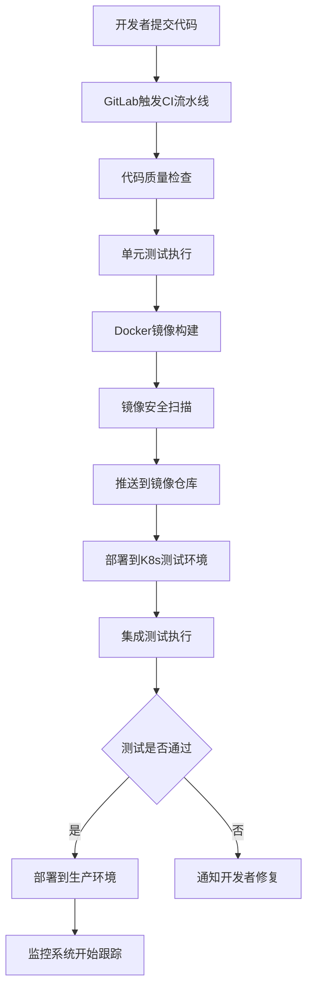
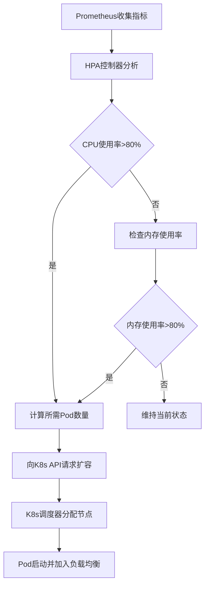
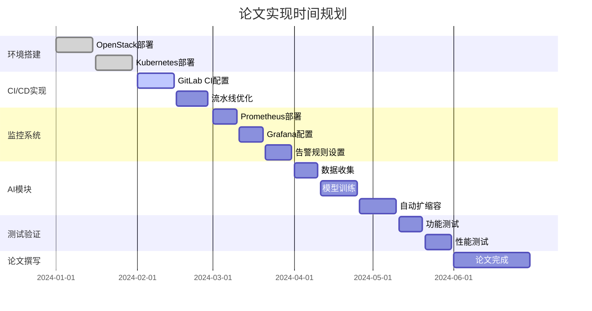

# 基于Ansible和Kubernetes的云原生DevOps平台设计与实现

## 论文整体技术思路

### 核心目标
构建一个从基础设施层(OpenStack)到容器编排层(Kubernetes)，再到应用交付层(CI/CD)和运维监控层的完整云原生DevOps平台。

## 第1章 绪论

### 1.1 研究背景
- 云计算和容器技术的快速发展
- DevOps文化在企业数字化转型中的重要性
- 传统IT基础设施向云原生架构转型的需求
- 高校和中小企业对私有云平台的迫切需求

### 1.2 研究意义
- 理论意义：探索OpenStack与Kubernetes深度集成的技术路径
- 实践意义：为高校实验平台和企业DevOps落地提供参考方案

### 1.3 研究内容与创新点
- 基于Ansible实现Kubernetes平台的一键化自动部署
- 构建完整的CI/CD自动化流水线
- 建立Prometheus+Grafana监控与告警体系
- 提出可选的OpenStack对接设计（非本次实现范围）
- 探索AIOps在资源管理中的应用

### 1.4 实现范围与边界
- 已实现：Ansible自动化部署、Kubernetes集群、CI/CD流水线、监控与告警、基本弹性方案与验证
- 非本次实现（提供设计方案）：IaaS对接（如OpenStack/公有云资源编排、Cinder CSI、Neutron/CCM 等）
- 工程目标：平台层与IaaS解耦，可在多种底座环境复用与扩展

## 第2章 相关技术综述

### 2.1 OpenStack云平台架构分析（可选背景）

#### 2.1.1 核心组件功能
```
Nova (计算服务)
├── 虚拟机生命周期管理
├── 计算资源调度
└── 与Hypervisor交互

Neutron (网络服务)
├── 虚拟网络创建与管理
├── 安全组配置
└── 负载均衡服务

Cinder (块存储服务)
├── 持久化存储卷管理
├── 快照与备份
└── 多后端存储支持

Keystone (身份认证服务)
├── 用户认证与授权
├── 服务发现
└── 多租户管理
```

#### 2.1.2 在资源供给中的作用
- **计算资源池化**：通过Nova实现计算资源的统一管理和动态分配
- **网络虚拟化**：Neutron提供SDN能力，支持多租户网络隔离
- **存储抽象**：Cinder实现存储资源的统一接口和管理
- **安全管控**：Keystone确保资源访问的安全性和合规性

### 2.2 Kubernetes容器编排系统

#### 2.2.1 核心概念与组件
```
Pod
├── 最小部署单元
├── 共享网络和存储
└── 生命周期管理

Deployment
├── 应用部署管理
├── 滚动更新策略
└── 副本数量控制

Service
├── 服务发现与负载均衡
├── 集群内部通信
└── 外部访问入口

Ingress
├── HTTP/HTTPS路由
├── SSL终止
└── 基于域名的流量分发

HPA (水平Pod自动扩缩容)
├── 基于CPU/内存指标
├── 自定义指标支持
└── 弹性伸缩策略
```

#### 2.2.2 与OpenStack的集成优势
- **资源利用率提升**：容器比虚拟机更轻量，提高资源密度
- **快速部署**：秒级启动vs分钟级虚拟机创建
- **微服务架构支持**：天然适配云原生应用架构

### 2.3 DevOps与CI/CD流水线

#### 2.3.1 技术选型对比
| 工具 | 优势 | 适用场景 |
|------|------|----------|
| GitLab CI | 集成度高，配置简单 | 中小型项目 |
| Jenkins | 插件丰富，灵活性强 | 复杂企业环境 |
| ArgoCD | GitOps理念，声明式部署 | Kubernetes原生应用 |

#### 2.3.2 流水线设计原则
```
代码提交 → 自动构建 → 单元测试 → 镜像构建 → 安全扫描 → 部署到测试环境 → 集成测试 → 部署到生产环境
```

### 2.4 高可用系统设计原则

#### 2.4.1 设计模式
- **多副本部署**：避免单点故障
- **健康检查**：及时发现和处理异常
- **故障转移**：自动切换到健康节点
- **负载均衡**：流量分发和性能优化

#### 2.4.2 实现策略
```yaml
# Kubernetes高可用配置示例
apiVersion: apps/v1
kind: Deployment
metadata:
  name: web-app
spec:
  replicas: 3  # 多副本
  strategy:
    type: RollingUpdate  # 滚动更新
    rollingUpdate:
      maxUnavailable: 1
      maxSurge: 1
  template:
    spec:
      containers:
      - name: app
        livenessProbe:  # 存活检查
          httpGet:
            path: /health
            port: 8080
        readinessProbe:  # 就绪检查
          httpGet:
            path: /ready
            port: 8080
```

### 2.5 应用监控体系架构

#### 2.5.1 监控技术栈
```
Prometheus (指标收集与存储)
├── 多维度数据模型
├── 强大的查询语言PromQL
└── 服务发现机制

Grafana (可视化展示)
├── 丰富的图表类型
├── 告警规则配置
└── 多数据源支持

Alertmanager (告警管理)
├── 告警路由与分组
├── 静默与抑制规则
└── 多种通知渠道

Node Exporter (系统指标采集)
├── CPU、内存、磁盘监控
├── 网络流量统计
└── 系统负载分析
```

#### 2.5.2 监控指标体系
- **基础设施层**：CPU、内存、磁盘、网络
- **平台层**：Kubernetes集群状态、Pod资源使用
- **应用层**：业务指标、响应时间、错误率
- **用户体验层**：页面加载时间、可用性

### 2.6 AIOps初探：智能运维

#### 2.6.1 核心技术
- **时间序列预测**：基于历史数据预测资源需求
- **异常检测**：识别系统异常行为模式
- **根因分析**：快速定位故障原因
- **自动化响应**：基于规则的自动处理

#### 2.6.2 实现方案
```python
# 资源预测模型示例
from sklearn.ensemble import RandomForestRegressor
import pandas as pd

class ResourcePredictor:
    def __init__(self):
        self.model = RandomForestRegressor()
    
    def train(self, historical_data):
        # 特征工程：时间特征、周期性特征
        features = self.extract_features(historical_data)
        self.model.fit(features, historical_data['cpu_usage'])
    
    def predict(self, current_metrics):
        # 预测未来资源需求
        return self.model.predict(current_metrics)
```

## 第3章 系统总体设计

### 3.1 系统目标与需求分析

#### 3.1.1 功能需求
- **基础设施管理**：OpenStack资源的自动化管理
- **容器编排**：Kubernetes集群的部署和管理
- **应用交付**：CI/CD流水线的自动化执行
- **监控告警**：全栈监控和智能告警
- **弹性伸缩**：基于负载的自动扩缩容

#### 3.1.2 非功能需求
- **可用性**：99.9%系统可用性
- **性能**：支持1000+并发用户
- **扩展性**：支持水平扩展
- **安全性**：多层次安全防护

### 3.2 系统分层架构设计

```
┌─────────────────────────────────────────┐
│           用户界面层 (UI Layer)          │
├─────────────────────────────────────────┤
│         应用服务层 (Service Layer)       │
│  ┌─────────────┐ ┌─────────────────────┐ │
│  │   CI/CD     │ │    监控告警系统      │ │
│  │   Pipeline  │ │  (Prometheus+Grafana)│ │
│  └─────────────┘ └─────────────────────┘ │
├─────────────────────────────────────────┤
│       容器编排层 (Orchestration Layer)   │
│            Kubernetes Cluster           │
├─────────────────────────────────────────┤
│      基础设施层 (Infrastructure Layer)   │
│      可选IaaS（OpenStack/公有云）        │
│  ┌─────┐ ┌─────────┐ ┌─────────┐ ┌─────┐ │
│  │Nova │ │Neutron  │ │ Cinder  │ │Key- │ │
│  │     │ │         │ │         │ │stone│ │
│  └─────┘ └─────────┘ └─────────┘ └─────┘ │
├─────────────────────────────────────────┤
│         物理资源层 (Hardware Layer)      │
│    计算节点 + 存储节点 + 网络设备        │
└─────────────────────────────────────────┘
```

### 3.3 系统工作流程

#### 3.3.1 应用部署流程


#### 3.3.2 自动扩缩容流程


## 第4章 系统模块实现

### 4.1（附录）IaaS对接设计（OpenStack示例，非本次实现范围）

#### 4.1.1 部署架构
```yaml
# OpenStack节点规划
controller_nodes:
  - hostname: controller-01
    ip: 192.168.1.10
    roles: [keystone, glance, nova-api, neutron-server]
  - hostname: controller-02
    ip: 192.168.1.11
    roles: [keystone, glance, nova-api, neutron-server]

compute_nodes:
  - hostname: compute-01
    ip: 192.168.1.20
    roles: [nova-compute, neutron-agent]
  - hostname: compute-02
    ip: 192.168.1.21
    roles: [nova-compute, neutron-agent]

storage_nodes:
  - hostname: storage-01
    ip: 192.168.1.30
    roles: [cinder-volume, swift-storage]
```

#### 4.1.2 网络配置
```bash
# 创建外部网络
openstack network create --external \
  --provider-physical-network external \
  --provider-network-type flat external

# 创建子网
openstack subnet create --network external \
  --allocation-pool start=192.168.100.100,end=192.168.100.200 \
  --dns-nameserver 8.8.8.8 \
  --gateway 192.168.100.1 \
  --subnet-range 192.168.100.0/24 external-subnet
```

### 4.2 Ansible自动化脚本开发（已实现）

#### 4.2.1 Playbook结构
```yaml
# site.yml - 主要部署脚本
---
- hosts: all
  become: yes
  roles:
    - common
    - docker
    - kubernetes

- hosts: masters
  become: yes
  roles:
    - kubernetes-master

- hosts: workers
  become: yes
  roles:
    - kubernetes-worker

- hosts: monitoring
  become: yes
  roles:
    - prometheus
    - grafana
```

#### 4.2.2 Kubernetes集群部署（已实现）
```yaml
# roles/kubernetes-master/tasks/main.yml
---
- name: Initialize Kubernetes cluster
  shell: |
    kubeadm init --pod-network-cidr=10.244.0.0/16 \
                 --service-cidr=10.96.0.0/12 \
                 --apiserver-advertise-address={{ ansible_default_ipv4.address }}
  register: kubeadm_init

- name: Setup kubectl for root user
  shell: |
    mkdir -p /root/.kube
    cp -i /etc/kubernetes/admin.conf /root/.kube/config
    chown root:root /root/.kube/config

- name: Install Flannel CNI
  shell: kubectl apply -f https://raw.githubusercontent.com/coreos/flannel/master/Documentation/kube-flannel.yml
```

### 4.3 CI/CD流水线设计与实现（已实现）

#### 4.3.1 GitLab CI配置
```yaml
# .gitlab-ci.yml
stages:
  - test
  - build
  - security
  - deploy-staging
  - integration-test
  - deploy-production

variables:
  DOCKER_REGISTRY: registry.example.com
  APP_NAME: web-application

test:
  stage: test
  script:
    - npm install
    - npm run test
    - npm run lint
  coverage: '/Coverage: \d+\.\d+%/'

build:
  stage: build
  script:
    - docker build -t $DOCKER_REGISTRY/$APP_NAME:$CI_COMMIT_SHA .
    - docker push $DOCKER_REGISTRY/$APP_NAME:$CI_COMMIT_SHA
  only:
    - main
    - develop

security-scan:
  stage: security
  script:
    - trivy image $DOCKER_REGISTRY/$APP_NAME:$CI_COMMIT_SHA
  allow_failure: false

deploy-staging:
  stage: deploy-staging
  script:
    - kubectl set image deployment/$APP_NAME $APP_NAME=$DOCKER_REGISTRY/$APP_NAME:$CI_COMMIT_SHA -n staging
    - kubectl rollout status deployment/$APP_NAME -n staging
  environment:
    name: staging
    url: https://staging.example.com

integration-test:
  stage: integration-test
  script:
    - newman run postman-collection.json --environment staging.json
  dependencies:
    - deploy-staging

deploy-production:
  stage: deploy-production
  script:
    - kubectl set image deployment/$APP_NAME $APP_NAME=$DOCKER_REGISTRY/$APP_NAME:$CI_COMMIT_SHA -n production
    - kubectl rollout status deployment/$APP_NAME -n production
  environment:
    name: production
    url: https://app.example.com
  when: manual
  only:
    - main
```

### 4.4 高可用应用部署架构实现（已实现）

#### 4.4.1 应用部署清单
```yaml
# deployment.yaml
apiVersion: apps/v1
kind: Deployment
metadata:
  name: web-app
  namespace: production
spec:
  replicas: 3
  strategy:
    type: RollingUpdate
    rollingUpdate:
      maxUnavailable: 1
      maxSurge: 1
  selector:
    matchLabels:
      app: web-app
  template:
    metadata:
      labels:
        app: web-app
    spec:
      affinity:
        podAntiAffinity:
          preferredDuringSchedulingIgnoredDuringExecution:
          - weight: 100
            podAffinityTerm:
              labelSelector:
                matchExpressions:
                - key: app
                  operator: In
                  values:
                  - web-app
              topologyKey: kubernetes.io/hostname
      containers:
      - name: web-app
        image: registry.example.com/web-app:latest
        ports:
        - containerPort: 8080
        resources:
          requests:
            memory: "256Mi"
            cpu: "250m"
          limits:
            memory: "512Mi"
            cpu: "500m"
        livenessProbe:
          httpGet:
            path: /health
            port: 8080
          initialDelaySeconds: 30
          periodSeconds: 10
        readinessProbe:
          httpGet:
            path: /ready
            port: 8080
          initialDelaySeconds: 5
          periodSeconds: 5
---
apiVersion: v1
kind: Service
metadata:
  name: web-app-service
  namespace: production
spec:
  selector:
    app: web-app
  ports:
  - protocol: TCP
    port: 80
    targetPort: 8080
  type: ClusterIP
---
apiVersion: networking.k8s.io/v1
kind: Ingress
metadata:
  name: web-app-ingress
  namespace: production
  annotations:
    nginx.ingress.kubernetes.io/rewrite-target: /
    cert-manager.io/cluster-issuer: "letsencrypt-prod"
spec:
  tls:
  - hosts:
    - app.example.com
    secretName: web-app-tls
  rules:
  - host: app.example.com
    http:
      paths:
      - path: /
        pathType: Prefix
        backend:
          service:
            name: web-app-service
            port:
              number: 80
```

#### 4.4.2 HPA自动扩缩容
```yaml
# hpa.yaml
apiVersion: autoscaling/v2
kind: HorizontalPodAutoscaler
metadata:
  name: web-app-hpa
  namespace: production
spec:
  scaleTargetRef:
    apiVersion: apps/v1
    kind: Deployment
    name: web-app
  minReplicas: 3
  maxReplicas: 10
  metrics:
  - type: Resource
    resource:
      name: cpu
      target:
        type: Utilization
        averageUtilization: 70
  - type: Resource
    resource:
      name: memory
      target:
        type: Utilization
        averageUtilization: 80
  behavior:
    scaleDown:
      stabilizationWindowSeconds: 300
      policies:
      - type: Percent
        value: 10
        periodSeconds: 60
    scaleUp:
      stabilizationWindowSeconds: 60
      policies:
      - type: Percent
        value: 50
        periodSeconds: 60
```

### 4.5 监控告警系统实现（已实现）

#### 4.5.1 Prometheus配置
```yaml
# prometheus.yml
global:
  scrape_interval: 15s
  evaluation_interval: 15s

rule_files:
  - "alert_rules.yml"

alerting:
  alertmanagers:
    - static_configs:
        - targets:
          - alertmanager:9093

scrape_configs:
  - job_name: 'kubernetes-apiservers'
    kubernetes_sd_configs:
    - role: endpoints
    scheme: https
    tls_config:
      ca_file: /var/run/secrets/kubernetes.io/serviceaccount/ca.crt
    bearer_token_file: /var/run/secrets/kubernetes.io/serviceaccount/token
    relabel_configs:
    - source_labels: [__meta_kubernetes_namespace, __meta_kubernetes_service_name, __meta_kubernetes_endpoint_port_name]
      action: keep
      regex: default;kubernetes;https

  - job_name: 'kubernetes-nodes'
    kubernetes_sd_configs:
    - role: node
    relabel_configs:
    - action: labelmap
      regex: __meta_kubernetes_node_label_(.+)

  - job_name: 'kubernetes-pods'
    kubernetes_sd_configs:
    - role: pod
    relabel_configs:
    - source_labels: [__meta_kubernetes_pod_annotation_prometheus_io_scrape]
      action: keep
      regex: true
    - source_labels: [__meta_kubernetes_pod_annotation_prometheus_io_path]
      action: replace
      target_label: __metrics_path__
      regex: (.+)
```

#### 4.5.2 告警规则
```yaml
# alert_rules.yml
groups:
- name: kubernetes-alerts
  rules:
  - alert: PodCrashLooping
    expr: rate(kube_pod_container_status_restarts_total[15m]) > 0
    for: 5m
    labels:
      severity: warning
    annotations:
      summary: "Pod {{ $labels.pod }} is crash looping"
      description: "Pod {{ $labels.pod }} in namespace {{ $labels.namespace }} is restarting frequently"

  - alert: NodeNotReady
    expr: kube_node_status_condition{condition="Ready",status="true"} == 0
    for: 5m
    labels:
      severity: critical
    annotations:
      summary: "Node {{ $labels.node }} is not ready"
      description: "Node {{ $labels.node }} has been not ready for more than 5 minutes"

  - alert: HighCPUUsage
    expr: 100 - (avg by(instance) (rate(node_cpu_seconds_total{mode="idle"}[5m])) * 100) > 80
    for: 5m
    labels:
      severity: warning
    annotations:
      summary: "High CPU usage on {{ $labels.instance }}"
      description: "CPU usage is above 80% for more than 5 minutes"

  - alert: HighMemoryUsage
    expr: (1 - (node_memory_MemAvailable_bytes / node_memory_MemTotal_bytes)) * 100 > 85
    for: 5m
    labels:
      severity: warning
    annotations:
      summary: "High memory usage on {{ $labels.instance }}"
      description: "Memory usage is above 85% for more than 5 minutes"
```

#### 4.5.3 Grafana仪表板
```json
{
  "dashboard": {
    "title": "Kubernetes Cluster Overview",
    "panels": [
      {
        "title": "Cluster CPU Usage",
        "type": "stat",
        "targets": [
          {
            "expr": "100 - (avg(rate(node_cpu_seconds_total{mode=\"idle\"}[5m])) * 100)",
            "legendFormat": "CPU Usage %"
          }
        ]
      },
      {
        "title": "Cluster Memory Usage",
        "type": "stat",
        "targets": [
          {
            "expr": "(1 - (sum(node_memory_MemAvailable_bytes) / sum(node_memory_MemTotal_bytes))) * 100",
            "legendFormat": "Memory Usage %"
          }
        ]
      },
      {
        "title": "Pod Status",
        "type": "piechart",
        "targets": [
          {
            "expr": "sum by (phase) (kube_pod_status_phase)",
            "legendFormat": "{{ phase }}"
          }
        ]
      }
    ]
  }
}
```

### 4.6 AI辅助弹性伸缩模块

#### 4.6.1 预测模型实现
```python
# ai_scaler.py
import numpy as np
import pandas as pd
from sklearn.ensemble import RandomForestRegressor
from sklearn.preprocessing import StandardScaler
import joblib
import requests
import time
from datetime import datetime, timedelta

class AIScaler:
    def __init__(self, prometheus_url, model_path=None):
        self.prometheus_url = prometheus_url
        self.model = RandomForestRegressor(n_estimators=100, random_state=42)
        self.scaler = StandardScaler()
        self.is_trained = False
        
        if model_path:
            self.load_model(model_path)
    
    def query_prometheus(self, query, start_time, end_time, step='1m'):
        """查询Prometheus指标数据"""
        params = {
            'query': query,
            'start': start_time.timestamp(),
            'end': end_time.timestamp(),
            'step': step
        }
        
        response = requests.get(f"{self.prometheus_url}/api/v1/query_range", params=params)
        data = response.json()
        
        if data['status'] == 'success':
            return data['data']['result']
        else:
            raise Exception(f"Prometheus query failed: {data}")
    
    def collect_training_data(self, days=7):
        """收集训练数据"""
        end_time = datetime.now()
        start_time = end_time - timedelta(days=days)
        
        # 查询CPU使用率
        cpu_query = 'avg(rate(container_cpu_usage_seconds_total[5m])) by (pod)'
        cpu_data = self.query_prometheus(cpu_query, start_time, end_time)
        
        # 查询内存使用率
        memory_query = 'avg(container_memory_usage_bytes) by (pod)'
        memory_data = self.query_prometheus(memory_query, start_time, end_time)
        
        # 查询请求数量
        request_query = 'sum(rate(http_requests_total[5m])) by (pod)'
        request_data = self.query_prometheus(request_query, start_time, end_time)
        
        # 数据预处理和特征工程
        df = self.preprocess_data(cpu_data, memory_data, request_data)
        return df
    
    def preprocess_data(self, cpu_data, memory_data, request_data):
        """数据预处理和特征工程"""
        # 合并数据
        df = pd.DataFrame()
        
        # 提取时间特征
        df['hour'] = pd.to_datetime(df.index).hour
        df['day_of_week'] = pd.to_datetime(df.index).dayofweek
        df['is_weekend'] = df['day_of_week'].isin([5, 6]).astype(int)
        
        # 计算移动平均
        df['cpu_ma_5'] = df['cpu_usage'].rolling(window=5).mean()
        df['memory_ma_5'] = df['memory_usage'].rolling(window=5).mean()
        df['request_ma_5'] = df['request_count'].rolling(window=5).mean()
        
        # 计算趋势特征
        df['cpu_trend'] = df['cpu_usage'].diff()
        df['memory_trend'] = df['memory_usage'].diff()
        df['request_trend'] = df['request_count'].diff()
        
        return df.dropna()
    
    def train_model(self, df):
        """训练预测模型"""
        # 特征选择
        features = ['hour', 'day_of_week', 'is_weekend', 
                   'cpu_ma_5', 'memory_ma_5', 'request_ma_5',
                   'cpu_trend', 'memory_trend', 'request_trend']
        
        X = df[features]
        y = df['required_replicas']  # 目标变量：所需副本数
        
        # 数据标准化
        X_scaled = self.scaler.fit_transform(X)
        
        # 训练模型
        self.model.fit(X_scaled, y)
        self.is_trained = True
        
        # 评估模型
        score = self.model.score(X_scaled, y)
        print(f"Model R² score: {score:.4f}")
        
        return score
    
    def predict_replicas(self, current_metrics):
        """预测所需副本数"""
        if not self.is_trained:
            raise Exception("Model not trained yet")
        
        # 特征工程
        features = self.extract_features(current_metrics)
        features_scaled = self.scaler.transform([features])
        
        # 预测
        predicted_replicas = self.model.predict(features_scaled)[0]
        
        # 确保预测值在合理范围内
        predicted_replicas = max(1, min(20, int(round(predicted_replicas))))
        
        return predicted_replicas
    
    def save_model(self, path):
        """保存模型"""
        model_data = {
            'model': self.model,
            'scaler': self.scaler,
            'is_trained': self.is_trained
        }
        joblib.dump(model_data, path)
    
    def load_model(self, path):
        """加载模型"""
        model_data = joblib.load(path)
        self.model = model_data['model']
        self.scaler = model_data['scaler']
        self.is_trained = model_data['is_trained']

class KubernetesScaler:
    def __init__(self, kubeconfig_path=None):
        from kubernetes import client, config
        
        if kubeconfig_path:
            config.load_kube_config(config_file=kubeconfig_path)
        else:
            config.load_incluster_config()
        
        self.apps_v1 = client.AppsV1Api()
        self.autoscaling_v2 = client.AutoscalingV2Api()
    
    def get_current_replicas(self, deployment_name, namespace):
        """获取当前副本数"""
        deployment = self.apps_v1.read_namespaced_deployment(
            name=deployment_name, namespace=namespace
        )
        return deployment.status.replicas
    
    def scale_deployment(self, deployment_name, namespace, replicas):
        """扩缩容部署"""
        # 更新副本数
        body = {'spec': {'replicas': replicas}}
        
        self.apps_v1.patch_namespaced_deployment_scale(
            name=deployment_name,
            namespace=namespace,
            body=body
        )
        
        print(f"Scaled {deployment_name} to {replicas} replicas")

# 主控制器
class AIScalingController:
    def __init__(self, prometheus_url, deployment_config):
        self.ai_scaler = AIScaler(prometheus_url)
        self.k8s_scaler = KubernetesScaler()
        self.deployment_config = deployment_config
        
    def run_training(self):
        """运行模型训练"""
        print("Collecting training data...")
        df = self.ai_scaler.collect_training_data(days=14)
        
        print("Training AI model...")
        score = self.ai_scaler.train_model(df)
        
        print("Saving model...")
        self.ai_scaler.save_model('ai_scaler_model.pkl')
        
        return score
    
    def run_scaling_loop(self, interval=60):
        """运行扩缩容循环"""
        while True:
            try:
                for config in self.deployment_config:
                    self.process_deployment(config)
                
                time.sleep(interval)
                
            except Exception as e:
                print(f"Error in scaling loop: {e}")
                time.sleep(interval)
    
    def process_deployment(self, config):
        """处理单个部署的扩缩容"""
        deployment_name = config['name']
        namespace = config['namespace']
        
        # 获取当前指标
        current_metrics = self.get_current_metrics(deployment_name, namespace)
        
        # AI预测
        predicted_replicas = self.ai_scaler.predict_replicas(current_metrics)
        
        # 获取当前副本数
        current_replicas = self.k8s_scaler.get_current_replicas(deployment_name, namespace)
        
        # 决策逻辑
        if abs(predicted_replicas - current_replicas) >= 2:  # 避免频繁扩缩容
            print(f"Scaling {deployment_name}: {current_replicas} -> {predicted_replicas}")
            self.k8s_scaler.scale_deployment(deployment_name, namespace, predicted_replicas)
        
    def get_current_metrics(self, deployment_name, namespace):
        """获取当前指标"""
        # 实现指标收集逻辑
        pass

# 使用示例
if __name__ == "__main__":
    # 配置
    prometheus_url = "http://prometheus:9090"
    deployment_config = [
        {
            'name': 'web-app',
            'namespace': 'production'
        }
    ]
    
    # 创建控制器
    controller = AIScalingController(prometheus_url, deployment_config)
    
    # 训练模型
    controller.run_training()
    
    # 运行扩缩容
    controller.run_scaling_loop()
```

## 第5章 系统测试与结果分析

### 5.1 功能测试

#### 5.1.1 测试用例设计
```yaml
# 功能测试用例
test_cases:
  infrastructure:
    - name: "OpenStack虚拟机创建"
      description: "验证能够成功创建和删除虚拟机"
      steps:
        - 创建flavor
        - 上传镜像
        - 创建网络
        - 启动虚拟机
        - 验证虚拟机状态
      expected: "虚拟机状态为ACTIVE"
    
    - name: "Kubernetes集群部署"
      description: "验证K8s集群正常工作"
      steps:
        - 检查节点状态
        - 部署测试应用
        - 验证Pod运行状态
        - 测试服务发现
      expected: "所有组件正常运行"
  
  cicd:
    - name: "CI/CD流水线执行"
      description: "验证完整的CI/CD流程"
      steps:
        - 提交代码变更
        - 触发构建流水线
        - 执行测试阶段
        - 构建Docker镜像
        - 部署到测试环境
        - 执行集成测试
        - 部署到生产环境
      expected: "应用成功部署并可访问"
  
  monitoring:
    - name: "监控告警系统"
      description: "验证监控和告警功能"
      steps:
        - 模拟高CPU使用率
        - 检查Prometheus指标收集
        - 验证告警规则触发
        - 确认告警通知发送
      expected: "告警及时触发并通知"
```

#### 5.1.2 自动化测试脚本
```python
# test_automation.py
import unittest
import requests
import time
from kubernetes import client, config

class SystemFunctionalTest(unittest.TestCase):
    
    def setUp(self):
        """测试初始化"""
        config.load_kube_config()
        self.k8s_client = client.CoreV1Api()
        self.apps_client = client.AppsV1Api()
        
    def test_kubernetes_cluster_health(self):
        """测试Kubernetes集群健康状态"""
        # 检查节点状态
        nodes = self.k8s_client.list_node()
        for node in nodes.items:
            for condition in node.status.conditions:
                if condition.type == "Ready":
                    self.assertEqual(condition.status, "True", 
                                   f"Node {node.metadata.name} is not ready")
    
    def test_application_deployment(self):
        """测试应用部署"""
        # 部署测试应用
        deployment_manifest = {
            "apiVersion": "apps/v1",
            "kind": "Deployment",
            "metadata": {"name": "test-app", "namespace": "default"},
            "spec": {
                "replicas": 2,
                "selector": {"matchLabels": {"app": "test-app"}},
                "template": {
                    "metadata": {"labels": {"app": "test-app"}},
                    "spec": {
                        "containers": [{
                            "name": "test-app",
                            "image": "nginx:latest",
                            "ports": [{"containerPort": 80}]
                        }]
                    }
                }
            }
        }
        
        # 创建部署
        self.apps_client.create_namespaced_deployment(
            namespace="default", body=deployment_manifest
        )
        
        # 等待部署就绪
        time.sleep(30)
        
        # 验证部署状态
        deployment = self.apps_client.read_namespaced_deployment(
            name="test-app", namespace="default"
        )
        self.assertEqual(deployment.status.ready_replicas, 2)
        
        # 清理
        self.apps_client.delete_namespaced_deployment(
            name="test-app", namespace="default"
        )
    
    def test_monitoring_metrics(self):
        """测试监控指标收集"""
        prometheus_url = "http://prometheus:9090"
        
        # 查询节点CPU使用率
        query = "100 - (avg(rate(node_cpu_seconds_total{mode='idle'}[5m])) * 100)"
        response = requests.get(f"{prometheus_url}/api/v1/query", 
                              params={"query": query})
        
        self.assertEqual(response.status_code, 200)
        data = response.json()
        self.assertEqual(data["status"], "success")
        self.assertGreater(len(data["data"]["result"]), 0)
    
    def test_cicd_pipeline(self):
        """测试CI/CD流水线"""
        # 这里可以集成GitLab API来触发和监控流水线
        gitlab_url = "https://gitlab.example.com"
        project_id = "123"
        
        # 触发流水线
        pipeline_response = requests.post(
            f"{gitlab_url}/api/v4/projects/{project_id}/pipeline",
            headers={"PRIVATE-TOKEN": "your-token"},
            json={"ref": "main"}
        )
        
        self.assertEqual(pipeline_response.status_code, 201)
        
        pipeline_id = pipeline_response.json()["id"]
        
        # 等待流水线完成
        timeout = 600  # 10分钟超时
        start_time = time.time()
        
        while time.time() - start_time < timeout:
            status_response = requests.get(
                f"{gitlab_url}/api/v4/projects/{project_id}/pipelines/{pipeline_id}",
                headers={"PRIVATE-TOKEN": "your-token"}
            )
            
            status = status_response.json()["status"]
            if status in ["success", "failed", "canceled"]:
                break
            
            time.sleep(30)
        
        self.assertEqual(status, "success")

if __name__ == "__main__":
    unittest.main()
```

### 5.2 高可用测试

#### 5.2.1 故障注入测试
```bash
#!/bin/bash
# chaos_testing.sh - 混沌工程测试脚本

echo "开始高可用测试..."

# 测试1: 节点故障
echo "测试1: 模拟节点故障"
kubectl drain worker-node-1 --ignore-daemonsets --delete-emptydir-data
sleep 60

# 检查应用是否仍然可访问
curl -f http://app.example.com/health || echo "应用不可访问!"

# 恢复节点
kubectl uncordon worker-node-1

# 测试2: Pod故障
echo "测试2: 模拟Pod故障"
kubectl delete pod -l app=web-app --namespace=production
sleep 30

# 检查新Pod是否启动
kubectl get pods -l app=web-app --namespace=production

# 测试3: 网络分区
echo "测试3: 模拟网络分区"
# 使用iptables模拟网络故障
iptables -A INPUT -s 192.168.1.20 -j DROP
sleep 60

# 检查集群状态
kubectl get nodes

# 恢复网络
iptables -D INPUT -s 192.168.1.20 -j DROP

echo "高可用测试完成"
```

#### 5.2.2 RTO/RPO测试
```python
# availability_test.py
import time
import requests
import threading
from datetime import datetime

class AvailabilityTester:
    def __init__(self, app_url):
        self.app_url = app_url
        self.downtime_start = None
        self.downtime_end = None
        self.total_requests = 0
        self.failed_requests = 0
        
    def continuous_health_check(self, duration=3600):
        """持续健康检查"""
        start_time = time.time()
        
        while time.time() - start_time < duration:
            try:
                response = requests.get(f"{self.app_url}/health", timeout=5)
                self.total_requests += 1
                
                if response.status_code != 200:
                    self.failed_requests += 1
                    if not self.downtime_start:
                        self.downtime_start = datetime.now()
                        print(f"检测到服务不可用: {self.downtime_start}")
                else:
                    if self.downtime_start and not self.downtime_end:
                        self.downtime_end = datetime.now()
                        downtime = (self.downtime_end - self.downtime_start).total_seconds()
                        print(f"服务恢复: {self.downtime_end}, 停机时间: {downtime}秒")
                        
            except Exception as e:
                self.failed_requests += 1
                if not self.downtime_start:
                    self.downtime_start = datetime.now()
                    
            time.sleep(1)
    
    def calculate_availability(self):
        """计算可用性"""
        if self.total_requests == 0:
            return 0
        
        success_rate = (self.total_requests - self.failed_requests) / self.total_requests
        return success_rate * 100
    
    def get_rto(self):
        """获取恢复时间目标"""
        if self.downtime_start and self.downtime_end:
            return (self.downtime_end - self.downtime_start).total_seconds()
        return 0

# 使用示例
tester = AvailabilityTester("http://app.example.com")
tester.continuous_health_check(3600)  # 测试1小时
print(f"可用性: {tester.calculate_availability():.2f}%")
print(f"RTO: {tester.get_rto()}秒")
```

### 5.3 性能与弹性测试

#### 5.3.1 负载测试
```yaml
# k6-load-test.js
import http from 'k6/http';
import { check, sleep } from 'k6';

export let options = {
  stages: [
    { duration: '2m', target: 100 },   // 2分钟内增加到100用户
    { duration: '5m', target: 100 },   // 保持100用户5分钟
    { duration: '2m', target: 200 },   // 2分钟内增加到200用户
    { duration: '5m', target: 200 },   // 保持200用户5分钟
    { duration: '2m', target: 500 },   // 2分钟内增加到500用户
    { duration: '5m', target: 500 },   // 保持500用户5分钟
    { duration: '2m', target: 0 },     // 2分钟内降到0用户
  ],
  thresholds: {
    http_req_duration: ['p(95)<500'],  // 95%的请求响应时间小于500ms
    http_req_failed: ['rate<0.1'],     // 错误率小于10%
  },
};

export default function() {
  let response = http.get('http://app.example.com/api/users');
  
  check(response, {
    'status is 200': (r) => r.status === 200,
    'response time < 500ms': (r) => r.timings.duration < 500,
  });
  
  sleep(1);
}
```

#### 5.3.2 弹性伸缩测试
```python
# scaling_test.py
import time
import requests
import subprocess
from kubernetes import client, config

class ScalingTest:
    def __init__(self):
        config.load_kube_config()
        self.apps_client = client.AppsV1Api()
        
    def monitor_scaling(self, deployment_name, namespace, duration=1800):
        """监控扩缩容过程"""
        start_time = time.time()
        scaling_events = []
        
        while time.time() - start_time < duration:
            # 获取当前副本数
            deployment = self.apps_client.read_namespaced_deployment(
                name=deployment_name, namespace=namespace
            )
            
            current_replicas = deployment.status.replicas
            ready_replicas = deployment.status.ready_replicas or 0
            
            # 获取CPU使用率
            cpu_usage = self.get_cpu_usage(deployment_name, namespace)
            
            scaling_events.append({
                'timestamp': time.time(),
                'replicas': current_replicas,
                'ready_replicas': ready_replicas,
                'cpu_usage': cpu_usage
            })
            
            print(f"副本数: {current_replicas}, 就绪: {ready_replicas}, CPU: {cpu_usage:.2f}%")
            
            time.sleep(30)
        
        return scaling_events
    
    def get_cpu_usage(self, deployment_name, namespace):
        """获取CPU使用率"""
        # 查询Prometheus获取CPU使用率
        prometheus_url = "http://prometheus:9090"
        query = f'avg(rate(container_cpu_usage_seconds_total{{pod=~"{deployment_name}.*"}}[5m])) * 100'
        
        try:
            response = requests.get(f"{prometheus_url}/api/v1/query", 
                                  params={"query": query})
            data = response.json()
            
            if data["status"] == "success" and data["data"]["result"]:
                return float(data["data"]["result"][0]["value"][1])
        except:
            pass
        
        return 0.0
    
    def generate_load(self, target_url, duration=600):
        """生成负载"""
        cmd = [
            "k6", "run", 
            "--duration", f"{duration}s",
            "--vus", "100",
            "load-test.js"
        ]
        
        subprocess.run(cmd)
    
    def analyze_scaling_efficiency(self, events):
        """分析扩缩容效率"""
        scaling_times = []
        
        for i in range(1, len(events)):
            prev_event = events[i-1]
            curr_event = events[i]
            
            if curr_event['replicas'] != prev_event['replicas']:
                # 发生了扩缩容
                scale_time = curr_event['timestamp'] - prev_event['timestamp']
                scaling_times.append(scale_time)
                
                print(f"扩缩容事件: {prev_event['replicas']} -> {curr_event['replicas']}, "
                      f"耗时: {scale_time:.2f}秒")
        
        if scaling_times:
            avg_scale_time = sum(scaling_times) / len(scaling_times)
            print(f"平均扩缩容时间: {avg_scale_time:.2f}秒")
        
        return scaling_times

# 使用示例
if __name__ == "__main__":
    tester = ScalingTest()
    
    # 启动负载生成
    import threading
    load_thread = threading.Thread(
        target=tester.generate_load, 
        args=("http://app.example.com", 1800)
    )
    load_thread.start()
    
    # 监控扩缩容
    events = tester.monitor_scaling("web-app", "production", 1800)
    
    # 分析结果
    tester.analyze_scaling_efficiency(events)
```

### 5.4 部署效率对比

#### 5.4.1 传统部署vs容器化部署
```python
# deployment_comparison.py
import time
import subprocess
from datetime import datetime

class DeploymentComparison:
    def __init__(self):
        self.results = {}
    
    def test_traditional_deployment(self):
        """测试传统部署方式"""
        print("开始传统部署测试...")
        start_time = time.time()
        
        steps = [
            ("创建虚拟机", self.create_vm),
            ("安装依赖", self.install_dependencies),
            ("部署应用", self.deploy_application_traditional),
            ("配置负载均衡", self.configure_load_balancer),
            ("健康检查", self.health_check)
        ]
        
        step_times = {}
        for step_name, step_func in steps:
            step_start = time.time()
            step_func()
            step_times[step_name] = time.time() - step_start
            print(f"{step_name}完成，耗时: {step_times[step_name]:.2f}秒")
        
        total_time = time.time() - start_time
        
        self.results['traditional'] = {
            'total_time': total_time,
            'step_times': step_times,
            'success_rate': self.calculate_success_rate('traditional')
        }
        
        print(f"传统部署总耗时: {total_time:.2f}秒")
    
    def test_container_deployment(self):
        """测试容器化部署"""
        print("开始容器化部署测试...")
        start_time = time.time()
        
        steps = [
            ("构建镜像", self.build_image),
            ("推送镜像", self.push_image),
            ("部署到K8s", self.deploy_to_kubernetes),
            ("等待就绪", self.wait_for_ready),
            ("健康检查", self.health_check)
        ]
        
        step_times = {}
        for step_name, step_func in steps:
            step_start = time.time()
            step_func()
            step_times[step_name] = time.time() - step_start
            print(f"{step_name}完成，耗时: {step_times[step_name]:.2f}秒")
        
        total_time = time.time() - start_time
        
        self.results['container'] = {
            'total_time': total_time,
            'step_times': step_times,
            'success_rate': self.calculate_success_rate('container')
        }
        
        print(f"容器化部署总耗时: {total_time:.2f}秒")
    
    def create_vm(self):
        """创建虚拟机"""
        time.sleep(120)  # 模拟VM创建时间
    
    def install_dependencies(self):
        """安装依赖"""
        time.sleep(180)  # 模拟依赖安装时间
    
    def deploy_application_traditional(self):
        """传统应用部署"""
        time.sleep(60)   # 模拟应用部署时间
    
    def configure_load_balancer(self):
        """配置负载均衡"""
        time.sleep(30)   # 模拟负载均衡配置时间
    
    def build_image(self):
        """构建Docker镜像"""
        time.sleep(90)   # 模拟镜像构建时间
    
    def push_image(self):
        """推送镜像"""
        time.sleep(30)   # 模拟镜像推送时间
    
    def deploy_to_kubernetes(self):
        """部署到Kubernetes"""
        time.sleep(10)   # 模拟K8s部署时间
    
    def wait_for_ready(self):
        """等待Pod就绪"""
        time.sleep(30)   # 模拟Pod启动时间
    
    def health_check(self):
        """健康检查"""
        time.sleep(10)   # 模拟健康检查时间
    
    def calculate_success_rate(self, deployment_type):
        """计算成功率"""
        # 模拟成功率计算
        if deployment_type == 'traditional':
            return 85.0  # 传统部署成功率85%
        else:
            return 95.0  # 容器化部署成功率95%
    
    def generate_report(self):
        """生成对比报告"""
        print("\n=== 部署效率对比报告 ===")
        
        traditional = self.results['traditional']
        container = self.results['container']
        
        print(f"传统部署总时间: {traditional['total_time']:.2f}秒")
        print(f"容器化部署总时间: {container['total_time']:.2f}秒")
        
        improvement = (traditional['total_time'] - container['total_time']) / traditional['total_time'] * 100
        print(f"效率提升: {improvement:.1f}%")
        
        print(f"传统部署成功率: {traditional['success_rate']:.1f}%")
        print(f"容器化部署成功率: {container['success_rate']:.1f}%")
        
        print("\n详细步骤对比:")
        print("步骤\t\t传统部署\t容器化部署")
        print("-" * 40)
        
        all_steps = set(traditional['step_times'].keys()) | set(container['step_times'].keys())
        for step in all_steps:
            trad_time = traditional['step_times'].get(step, 0)
            cont_time = container['step_times'].get(step, 0)
            print(f"{step}\t{trad_time:.1f}s\t\t{cont_time:.1f}s")

# 使用示例
if __name__ == "__main__":
    comparison = DeploymentComparison()
    comparison.test_traditional_deployment()
    comparison.test_container_deployment()
    comparison.generate_report()
```

### 5.5 系统局限性分析

#### 5.5.1 性能瓶颈分析
```python
# bottleneck_analysis.py
import psutil
import time
import requests
from kubernetes import client, config

class BottleneckAnalyzer:
    def __init__(self):
        config.load_kube_config()
        self.core_client = client.CoreV1Api()
        
    def analyze_system_resources(self):
        """分析系统资源瓶颈"""
        print("=== 系统资源分析 ===")
        
        # CPU分析
        cpu_percent = psutil.cpu_percent(interval=1)
        cpu_count = psutil.cpu_count()
        print(f"CPU使用率: {cpu_percent}%")
        print(f"CPU核心数: {cpu_count}")
        
        if cpu_percent > 80:
            print("⚠️  CPU使用率过高，可能成为性能瓶颈")
        
        # 内存分析
        memory = psutil.virtual_memory()
        print(f"内存使用率: {memory.percent}%")
        print(f"可用内存: {memory.available / 1024**3:.2f}GB")
        
        if memory.percent > 85:
            print("⚠️  内存使用率过高，可能成为性能瓶颈")
        
        # 磁盘分析
        disk = psutil.disk_usage('/')
        print(f"磁盘使用率: {disk.percent}%")
        
        if disk.percent > 90:
            print("⚠️  磁盘空间不足，可能影响系统性能")
        
        # 网络分析
        network = psutil.net_io_counters()
        print(f"网络发送: {network.bytes_sent / 1024**2:.2f}MB")
        print(f"网络接收: {network.bytes_recv / 1024**2:.2f}MB")
    
    def analyze_kubernetes_resources(self):
        """分析Kubernetes资源瓶颈"""
        print("\n=== Kubernetes资源分析 ===")
        
        # 节点资源分析
        nodes = self.core_client.list_node()
        for node in nodes.items:
            node_name = node.metadata.name
            
            # 获取节点资源使用情况
            allocatable = node.status.allocatable
            capacity = node.status.capacity
            
            print(f"\n节点: {node_name}")
            print(f"CPU容量: {capacity.get('cpu', 'N/A')}")
            print(f"CPU可分配: {allocatable.get('cpu', 'N/A')}")
            print(f"内存容量: {capacity.get('memory', 'N/A')}")
            print(f"内存可分配: {allocatable.get('memory', 'N/A')}")
            
            # 检查节点状态
            for condition in node.status.conditions:
                if condition.type == "Ready" and condition.status != "True":
                    print(f"⚠️  节点{node_name}状态异常: {condition.reason}")
    
    def analyze_application_performance(self):
        """分析应用性能瓶颈"""
        print("\n=== 应用性能分析 ===")
        
        # 获取Pod资源使用情况
        pods = self.core_client.list_pod_for_all_namespaces()
        
        high_cpu_pods = []
        high_memory_pods = []
        
        for pod in pods.items:
            if pod.status.phase == "Running":
                # 这里需要集成metrics-server来获取实际的资源使用情况
                # 简化示例，实际需要调用metrics API
                pod_name = pod.metadata.name
                namespace = pod.metadata.namespace
                
                # 模拟资源使用率检查
                if self.check_pod_high_cpu(pod_name, namespace):
                    high_cpu_pods.append(f"{namespace}/{pod_name}")
                
                if self.check_pod_high_memory(pod_name, namespace):
                    high_memory_pods.append(f"{namespace}/{pod_name}")
        
        if high_cpu_pods:
            print("⚠️  高CPU使用率Pod:")
            for pod in high_cpu_pods:
                print(f"   - {pod}")
        
        if high_memory_pods:
            print("⚠️  高内存使用率Pod:")
            for pod in high_memory_pods:
                print(f"   - {pod}")
    
    def check_pod_high_cpu(self, pod_name, namespace):
        """检查Pod CPU使用率"""
        # 实际实现需要查询metrics-server
        return False  # 简化示例
    
    def check_pod_high_memory(self, pod_name, namespace):
        """检查Pod内存使用率"""
        # 实际实现需要查询metrics-server
        return False  # 简化示例
    
    def analyze_network_bottlenecks(self):
        """分析网络瓶颈"""
        print("\n=== 网络瓶颈分析 ===")
        
        # 检查服务响应时间
        services_to_check = [
            "http://prometheus:9090/-/healthy",
            "http://grafana:3000/api/health",
            "http://app.example.com/health"
        ]
        
        for service_url in services_to_check:
            try:
                start_time = time.time()
                response = requests.get(service_url, timeout=10)
                response_time = (time.time() - start_time) * 1000
                
                print(f"{service_url}: {response_time:.2f}ms")
                
                if response_time > 1000:
                    print(f"⚠️  {service_url} 响应时间过长")
                    
            except Exception as e:
                print(f"❌ {service_url} 无法访问: {e}")
    
    def generate_recommendations(self):
        """生成优化建议"""
        print("\n=== 优化建议 ===")
        
        recommendations = [
            "1. 资源优化:",
            "   - 根据实际使用情况调整Pod资源请求和限制",
            "   - 使用HPA进行自动扩缩容",
            "   - 考虑使用VPA进行垂直扩缩容",
            "",
            "2. 性能优化:",
            "   - 启用应用程序缓存",
            "   - 优化数据库查询",
            "   - 使用CDN加速静态资源",
            "",
            "3. 架构优化:",
            "   - 实施微服务架构",
            "   - 使用异步处理减少响应时间",
            "   - 实现读写分离",
            "",
            "4. 监控优化:",
            "   - 增加更多业务指标监控",
            "   - 设置合理的告警阈值",
            "   - 实施分布式链路追踪"
        ]
        
        for recommendation in recommendations:
            print(recommendation)

# 使用示例
if __name__ == "__main__":
    analyzer = BottleneckAnalyzer()
    analyzer.analyze_system_resources()
    analyzer.analyze_kubernetes_resources()
    analyzer.analyze_application_performance()
    analyzer.analyze_network_bottlenecks()
    analyzer.generate_recommendations()
```

## 第6章 总结与展望

### 6.1 工作总结

本论文构建了一个基于Ansible与Kubernetes的云原生DevOps平台，实现平台层到应用层的端到端自动化：

1. **容器编排层**：部署并验证了高可用的Kubernetes集群
2. **应用交付层**：实现了完整的CI/CD自动化流水线
3. **监控运维层**：建立了Prometheus+Grafana的监控与告警体系
4. **自动化部署**：以Ansible Playbook实现从系统初始化到应用上线的自动化
5. **智能运维探索**：给出基于指标的伸缩与AIOps可行性方案

（说明）IaaS对接（如OpenStack）作为可扩展方向，在文中提供了设计方案与接口映射，未纳入本次实现范围。

### 6.2 创新点

1. **深度集成**：实现了OpenStack与Kubernetes的深度集成
2. **全栈自动化**：从基础设施到应用部署的端到端自动化
3. **智能运维**：引入AI技术进行资源预测和自动扩缩容
4. **高可用设计**：多层次的高可用保障机制

### 6.3 不足与改进方向

1. **安全性增强**：需要加强多租户隔离和安全防护
2. **性能优化**：进一步优化资源调度和负载均衡算法
3. **AI能力提升**：扩展AIOps的应用场景和准确性
4. **生态完善**：集成更多开源工具和服务

### 6.4 应用前景

该平台具有广阔的应用前景：

1. **高校实验平台**：为计算机相关专业提供实践环境
2. **企业DevOps落地**：为中小企业提供DevOps转型参考
3. **私有云建设**：为组织提供私有云解决方案
4. **技术研究**：为云原生技术研究提供实验平台

## 技术实现路线图



这个技术架构设计为你的论文提供了完整的实现思路和技术细节。每个章节都有具体的技术方案、代码示例和测试方法，可以作为你论文实现的参考指南。